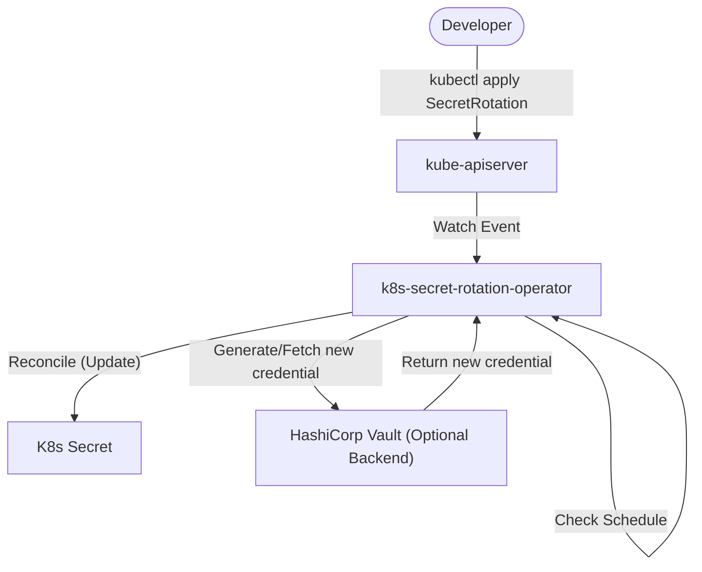

# Architecture — k8s-secret-rotation-operator
> Last updated: 2026-08-29 | Maturity: Full Prototype
> _Kubernetes operator for automated secret rotation._

## System Diagram
The following Mermaid.js sequence diagram maps the core workflow and interactions:

## Component Table

| Component | File | Responsibility | Tech |
|---|---|---|---|
| SecretRotation CRD | `api/v1alpha1/secretrotation_types.go` | Defines the API schema for rotation policies | Go |
| Controller | `controllers/secretrotation_controller.go` | Main reconciliation loop enforcing schedule | Go |
| Generator | `internal/generator/generator.go` | Logic for auto-generating strong keys or fetching from Vault | Go |

## Port Assignments

| Service | Port | Notes |
|---|---|---|
| Metrics | `8080` | Prometheus metrics endpoint exposed by controller-runtime |
| Healthz | `8081` | Liveness and readiness probes |

## Dependency Honesty Table

| Dependency | Status | Notes |
|---|---|---|
| Kubernetes API Server | **Real** | Controller directly talks to the K8s API to manage resources. |
| HashiCorp Vault | **Optional** | E2E test scripts use Vault Dev mode to verify external backend rotation. |
| kind (Local Cluster) | **Optional** | Used for E2E tests and local development. |

## The Reconciliation Pattern
Kubernetes operators follow the **reconciliation loop** pattern:
1. Watch for changes to the `SecretRotation` custom resource
2. Compare desired state (the CR spec) to actual state (the Secret's current value)
3. Take corrective action to converge (rotate the secret)
4. Update status to reflect the new state

## CRD Design
The `SecretRotation` CRD extends the Kubernetes API with a new resource type. It has:
- **Spec**: What the user wants (which secret, when to rotate, how to generate new values)
- **Status**: What's actually happening (last rotation time, count, phase)

## RBAC
The operator only has the minimum permissions needed:
- Read/write `SecretRotation` resources and their status
- Read/write `Secret` resources (to actually rotate values)
- Create events (for audit logging)

## Why Go + kubebuilder?
Go is the native Kubernetes language. `controller-runtime` provides the production-grade reconciliation framework (leader election, health probes, metrics). kubebuilder scaffolds the project structure that the Kubernetes community expects.